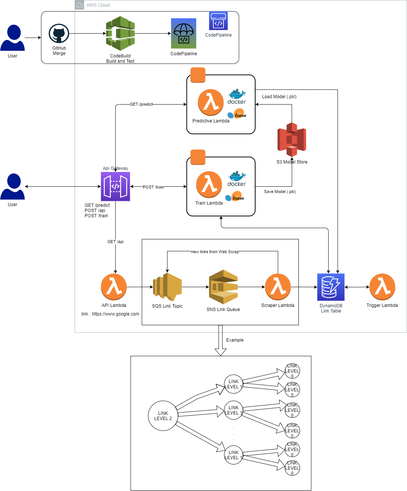

# Mercado Livre Challenge



## How to Clone and Deploy the project

First, install aws cli.

```
[AWS CLI](https://docs.aws.amazon.com/cli/latest/userguide/install-cliv2.html)
```
The  we need to configure our aws profile at local environment.

```
$ aws configure
```
Then we can use [npm](https://nodejs.org/en/download/) to install aws-cdk

```
$ npm install -g aws-cdk
```
To manually create a virtualenv:

```
$ python3 -m venv .venv
```
Before configure our stack, we need to clone the repository

```
$ git clone git@github.com:raafaadg/mercado-livre-mlops.git
```
Replace the values with your information

```bash
aws secretsmanager create-secret \
    --name personal/github \
    --secret-string '{"key":"YOUR_TOKEN", "owner":"OWNER"}'
```

Export your AWS Account ID and your prefeered region to deploy

```
$ set key=YOUR_TOKEN
$ set owner=OWNER
```

Activate your virtualenv on Windows.

```
$ .venv\Scripts\activate.bat
```

Then you can install the required dependencies.

```
$ pip install -r requirements.txt
```

Push to a new repo and deploy pipeline

```
$ cdk deploy mercado-libre-mlops-pipeline --require-approval never
```

Now, any new commit to the 'main' repo will be deployed to our infra.
But can also manually deploy the main stack with

```
$ cdk deploy mercado-libre-mlops --require-approval never
```

To add additional dependencies, just add them to your `setup.py` file and rerun the `pip install -r requirements.txt`
command.

Tests

```
$ python -m unittest tests/unit/lambdas.py
```

## Useful commands

 * `cdk ls`          list all stacks in the app
 * `cdk synth`       emits the synthesized CloudFormation template
 * `cdk deploy`      deploy this stack to your default AWS account/region
 * `cdk diff`        compare deployed stack with current state
 * `cdk docs`        open CDK documentation

## Api Requests
```
https://bcg3qa9gsa.execute-api.us-east-1.amazonaws.com/prod
```

 * `POST /api --d {"source_links":["https://google.com"], "level":2}`          start the job with the refereced links for the N Deep Level
 * `POST /train`       Train and Save new Random Forest Model
 * `GET /predict --d {"source_links":["https://google.com"]}`      get the prediction for the links


